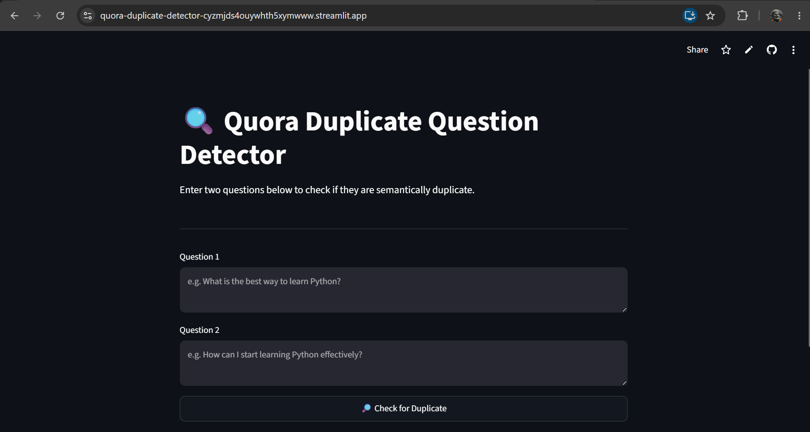

# 🔍 Quora Duplicate Question Detector

A Machine Learning web application that detects whether two questions are semantically duplicate — built with Random Forest, advanced NLP feature engineering, and deployed using Streamlit.

> Built on the \[Quora Question Pairs dataset](https://www.kaggle.com/competitions/quora-question-pairs) (400K+ question pairs).

\---

## 🚀 Live Demo

[https://quora-duplicate-detector-cyzmjds4ouywhth5xymwww.streamlit.app/]


## 📌 Problem Statement

Quora has millions of questions, many of which are paraphrased versions of each other. Identifying duplicate questions improves user experience by routing people to the best existing answer. This project builds a binary classifier to detect such pairs.

\---

## 🧠 Feature Engineering

The model uses **22 handcrafted NLP features** + **Bag of Words (BoW)** vectors for each question:

### Basic Features

|Feature|Description|
|-|-|
|`q1\_len`, `q2\_len`|Character length of each question|
|`q1\_words`, `q2\_words`|Word count of each question|
|`common\_words`|Number of common words between Q1 and Q2|
|`total\_words`|Total unique words across both|
|`word\_share`|Ratio of common to total words|

### Token Features (8)

* Common word ratio (min/max normalized)
* Common stopword ratio (min/max normalized)
* Common token ratio (min/max normalized)
* First/last word match flags

### Length Features (3)

* Absolute difference in word count
* Average token length
* Longest common substring ratio

### Fuzzy Features (4) — via `fuzzywuzzy`

* `QRatio`, `partial\_ratio`, `token\_sort\_ratio`, `token\_set\_ratio`

### BoW Vectors

* CountVectorizer on Q1 and Q2 independently (top 3000 features each)

\---

## 🗂️ Project Structure

```
quora-duplicate-detector/
│
├── app.py                        # Streamlit frontend
├── helper.py                     # Feature engineering pipeline
├── model.pkl                     # Trained Random Forest model (\~94MB)
├── cv.pkl                        # Fitted CountVectorizer
├── requirements.txt              # Python dependencies
├── setup.sh                      # Streamlit server config
├── Procfile                      
├── .gitignore
└── Advanced\_feature\_extract.ipynb  # EDA + feature engineering notebook
```

\---

## ⚙️ Local Setup

### 1\. Clone the repository

```bash
git clone https://github.com/Harshal-yad/Quora-Duplicate-Detector.git
```

### 2\. Create a virtual environment

```bash
python -m venv venv
source venv/bin/activate      # On Windows: venv\\Scripts\\activate
```

### 3\. Install dependencies

```bash
pip install -r requirements.txt
```

### 4\. Run the app

```bash
streamlit run app.py
```

The app will open at `http://localhost:8501`

\---

## 🔬 Model Details

|Property|Value|
|-|-|
|Algorithm|Random Forest Classifier|
|Dataset|Quora Question Pairs (Kaggle)|
|Training samples|\~300,000 pairs|
|Feature vector size|22 + 6000 (BoW)|
|Preprocessing|Contraction expansion, HTML stripping, punctuation removal, lowercasing|

\---

## 📦 Tech Stack

* **Python** 
* **Streamlit** — Web UI
* **scikit-learn** — Model training
* **fuzzywuzzy** — Fuzzy string matching features
* **distance** — Longest common substring
* **BeautifulSoup4** — HTML tag removal
* **NLTK** — Stopwords \& CountVectorizer
* **NumPy** — Feature vector assembly

\---

## 🙋 Author

**Harshal**  
B.Tech, School of Electronics \& Communication Engineering — VIT Vellore  
[GitHub](https://github.com/Harshal-yad) • [LinkedIn](https://www.linkedin.com/in/harshal-yadav-aiml/)

\---

## 📄 License

This project is open source under the [MIT License](LICENSE).

